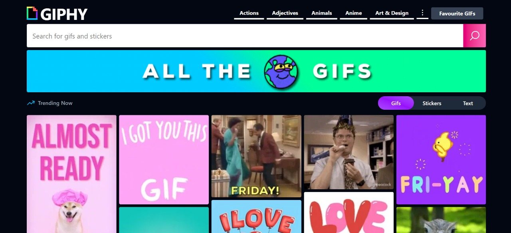

# GIPHY React App

A modern, responsive GIF search and discovery app built with **React**, **Vite**, and **Tailwind CSS** using the [GIPHY API](https://developers.giphy.com/).

## Features

- 🔍 **Search GIFs & Stickers:** Find GIFs and stickers by keyword.
- 🏷️ **Browse Categories:** Explore trending and categorized GIFs.
- ⭐ **Favourites:** Save your favourite GIFs for quick access.
- 📄 **Single GIF View:** View GIF details, share and download.
- 🎨 **Responsive UI:** Clean, mobile-friendly design with Tailwind CSS.

## Screenshots



## Getting Started

### Prerequisites

- [Node.js](https://nodejs.org/) 
- [npm](https://www.npmjs.com/) or [yarn](https://yarnpkg.com/)

### Installation

1. **Clone the repository:**
   ```sh
   git clone https://github.com/SagarLonkar-18/GIPHY.git
   cd giphy
   ```

2. **Install dependencies:**
   ```sh
   npm install
   # or
   yarn
   ```

3. **Set up your GIPHY API key:**
   - Create a `.env` file in the root directory.
   - Add your API key:
     ```
     VITE_GIPHY_API_KEY=your_giphy_api_key_here
     ```

4. **Start the development server:**
   ```sh
   npm run dev
   # or
   yarn dev
   ```

5. **Open in your browser:**
   - Visit [http://localhost:5173](http://localhost:5173)

## Project Structure

```
src/
  components/    # Reusable UI components (FilterGifs, GifSearch, Gif, FollowOn, Navbar)
  context/       # React Context for global state (GifContext)
  layout/        # App layout components
  pages/         # Page components (Home, Categories, Search, SingleGif, Favourites)
  App.jsx        # Main app component
  main.jsx       # Entry point
  App.css        # Tailwind and custom styles
```

## Scripts

- `npm run dev` – Start development server

## Credits

- [GIPHY API](https://developers.giphy.com/)
- [React](https://react.dev/)
- [Vite](https://vitejs.dev/)
- [Tailwind CSS](https://tailwindcss.com/)

_Enjoy searching and sharing GIFs!_